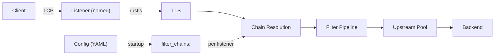
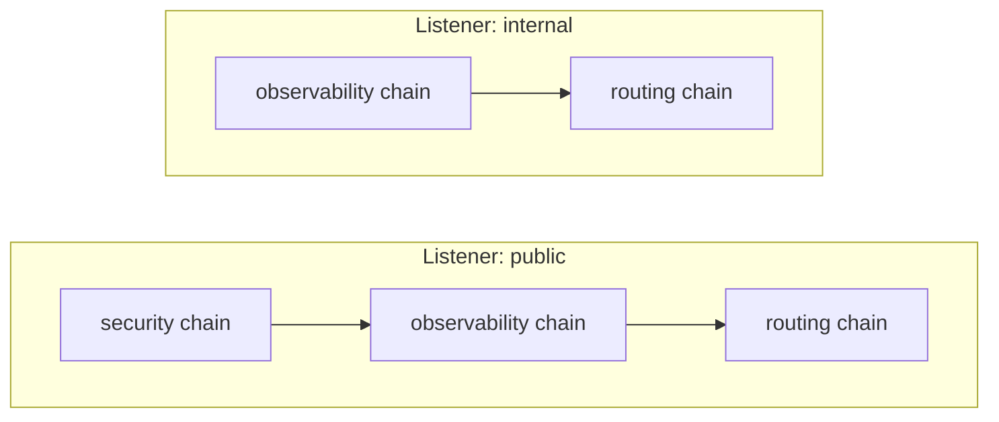
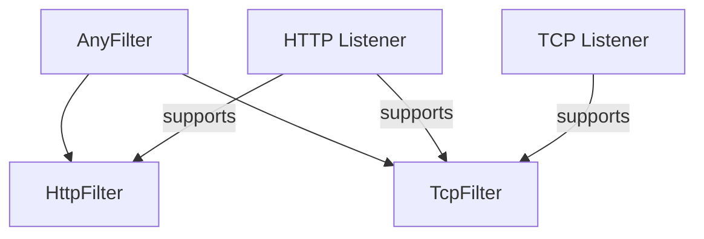
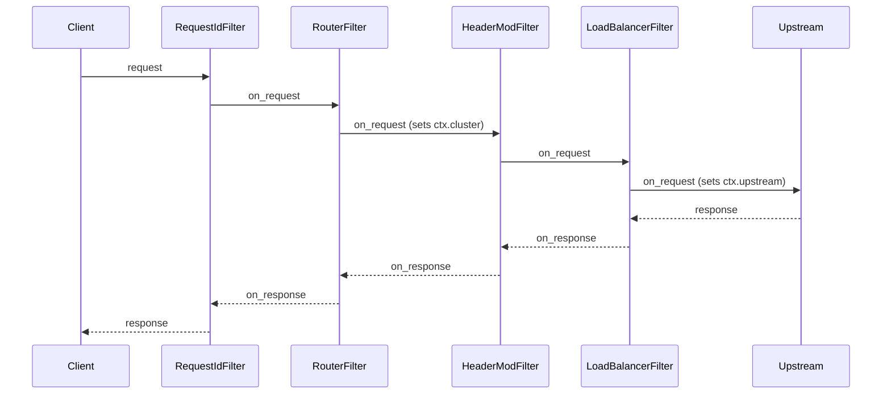
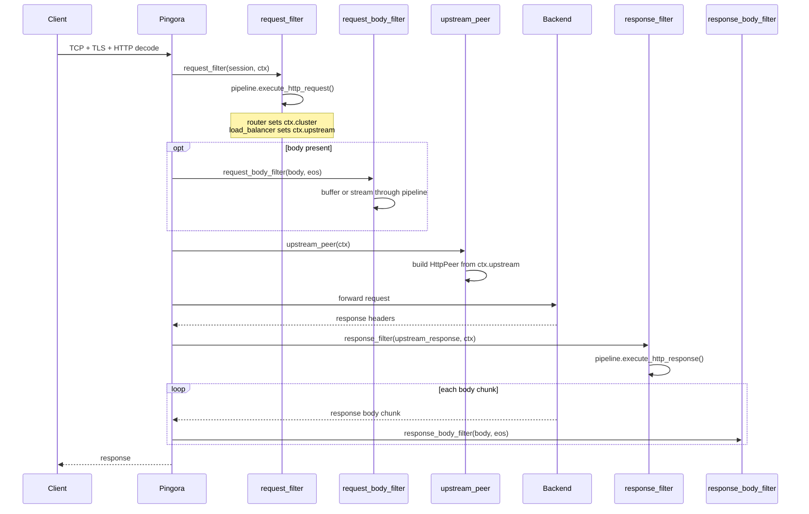
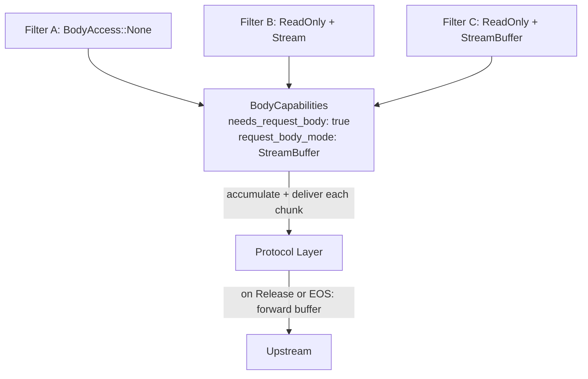
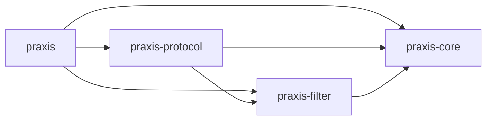
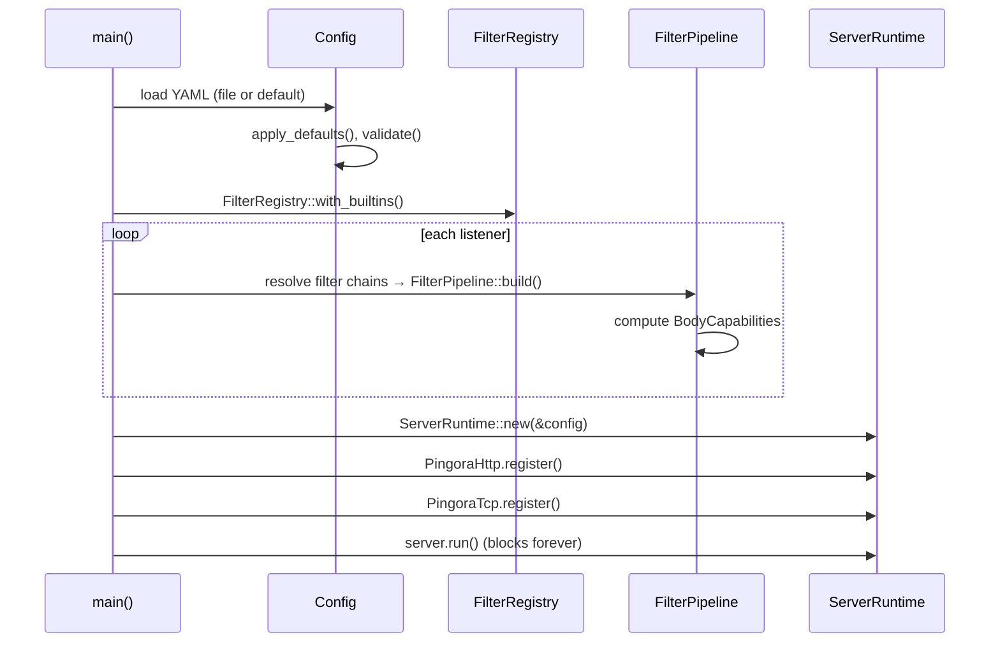

# Architecture

## Design Principles

**Separation of Concerns.** Praxis is a **framework** for
building proxy servers, in addition to providing core builds.
Core behaviors (routing, load balancing, etc) use the same
filter traits as extensions. No architectural privilege, no
second extension mechanism.

**Use upstream protocols; contribute upstream.** Protocol
adapters delegate transport to upstream libraries. If a
capability is missing, contribute it upstream. Adapter crates
must stay thin; extensive protocol logic belongs in its own
crate, ideally upstream.

**Safety and performance.** Rustls over OpenSSL by default.
Minimize hot-path allocations; `Bytes` for zero-copy buffer
sharing. `#![deny(unsafe_code)]` everywhere.

**General-Purpose with Notable Specializations.** Praxis is
designed to be general purpose, but there are specialized
use-cases that are covered as well. These use cases are built
as 1st party [extensions] and include: Egress, AI Inference,
AI Agents, etc.

[extensions]:./extensions.md

## Primary Use-Cases

- **Ingress**: Reverse proxy, API gateway, edge proxy
- **Egress**: Outbound proxy, service-to-service
- **East/West**: Sidecar or converged proxy for service mesh
- **AI Inference**: Proxy for AI inference workloads (LLMs)
- **AI Agents**: Proxy for AI agents (MCP, A2A)
- **Security Gateway**: WAF, Network Policy

## System Architecture



Each listener has a `name` and a list of `filter_chains`.
At startup, the referenced chains are resolved and
concatenated into a single pipeline per listener. Different
listeners can compose different subsets of chains.

### Filter Chains and Composition

Filter chains are named, reusable groups of filters defined
at the top level of the config. A listener references one or
more chains by name; the filters are concatenated in order
to form that listener's pipeline.



This enables reuse without duplication. A "security" chain
can be shared across public listeners while internal
listeners skip it entirely.

### Protocol-Aware Filters

Filters are protocol-aware. HTTP filters implement the
`HttpFilter` trait (`on_request`, `on_response`, body hooks).
TCP filters implement the `TcpFilter` trait (`on_connect`,
`on_disconnect`). The `AnyFilter` enum wraps both variants
for storage in a unified pipeline.

Protocol compatibility is enforced via `ProtocolKind::stack()`
and `supports()`. An HTTP listener supports both HTTP and TCP
filters. A TCP listener supports only TCP filters.



### Filter-First Design

Every behavior is a filter. Built-in filters use the same
traits as user-provided filters.



Request filters run in declared order, response filters in
reverse. Any filter can short-circuit (e.g. 404, 403, 429).

See [filters.md](./filters.md) for extensive documentation.

#### Filter Extension Development

See [extensions.md](./extensions.md)

### What Stays Outside Filters

- TCP/TLS, HTTP framing, connection pooling: adapters
- Config loading and validation: `praxis-core`
- Pipeline executor and `HttpFilterContext`: `praxis-filter`

### Connection Lifecycle (HTTP)



1. TCP accept, TLS handshake, HTTP decode (Pingora)
2. `request_filter`: pipeline runs filters in order; router
   sets `ctx.cluster`, load balancer sets `ctx.upstream`
3. `request_body_filter`: buffer or stream body chunks
   through filters (if any filter declares body access)
4. `upstream_peer`: converts `ctx.upstream` to `HttpPeer`
5. `upstream_request_filter`: strips hop-by-hop headers
6. Request forwarded, response headers received
7. `response_filter`: pipeline runs filters in reverse
8. `response_body_filter`: stream response body through
   filters (synchronous; Pingora constraint)
9. Connection returned to pool

### Connection Lifecycle (TCP)

1. TCP accept, optional TLS handshake
2. `on_connect` : TCP filters run in order
3. Bidirectional byte forwarding to upstream
4. `on_disconnect` : TCP filters run on close

### Payload Processing

Filters declare body access needs at construction time via
`request_body_access()`, `response_body_access()`, and the
corresponding `*_body_mode()` methods. The pipeline
pre-computes aggregate `BodyCapabilities` at build time so
the protocol layer knows whether to buffer or stream.



Three delivery modes:

- **Stream**: chunks flow through filters as they arrive.
  Low latency, low memory.
- **Buffer**: the protocol layer accumulates chunks into a
  `BodyBuffer`, then delivers the full body in a single
  call. Required when any filter needs the complete body.
- **StreamBuffer**: chunks are delivered to filters
  incrementally (like Stream) but accumulated in a buffer
  and not forwarded to upstream until a filter returns
  `FilterAction::Release` or end-of-stream. After release,
  remaining chunks flow through in stream mode. No size
  limit by default; an optional `max_bytes` returns 413
  when exceeded. Enables streaming inspection with deferred
  forwarding for AI inference, Agentic networks, and
  Security systems use cases including content scanning,
  payload inspection, and body-based routing.

When StreamBuffer mode is active, the protocol layer
pre-reads the body during the request phase (before
upstream selection) so that body filters can influence
routing decisions. The pre-read body is stored and
forwarded to the upstream after the connection is
established.

Precedence: `Buffer` > `StreamBuffer` > `Stream`. If any
filter requests `Buffer`, the entire pipeline buffers. If
any filter requests `StreamBuffer` (and none requests
`Buffer`), the pipeline uses stream-buffered mode.
Global `max_request_body_bytes` / `max_response_body_bytes`
config limits force buffer mode for size enforcement even
when no filter requests body access.

The `on_response_body` hook is synchronous (not async)
because Pingora's `response_body_filter` callback is `fn`,
not `async fn`.

### Condition System

Filters can be conditionally executed based on request or
response attributes. Each `PipelineEntry` carries optional
`conditions` (request phase) and `response_conditions`
(response phase).

Condition types:

- **`when`**: execute the filter only if the predicate
  matches
- **`unless`**: skip the filter if the predicate matches

Request predicates: `path`, `path_prefix`, `methods`,
`headers`. Response predicates: `status`, `headers`. All
fields within a predicate use AND semantics; multiple
conditions short-circuit in order.

Request conditions gate both `on_request` and body hooks.
Response conditions gate only `on_response` and response
body hooks.

## Crate Layout

### Workspace Crates

**`praxis`** : Binary entry point. Loads YAML config, resolves
per-listener filter chains into pipelines, registers protocol
handlers, starts the server. Exposes `run_server_with_registry`
and `init_tracing` for extension binaries.

**`praxis-core`** : Configuration types (YAML parsing via
serde), validation, error types, upstream connectivity
options, and the `ServerRuntime` wrapper.

**`praxis-filter`** : Filter pipeline engine. Defines the
`HttpFilter` and `TcpFilter` traits, condition evaluation,
body access declarations, the `FilterPipeline` executor,
`FilterRegistry`, and all built-in filter implementations.

**`praxis-protocol`** : Thin protocol adapters that translate
upstream library callbacks (Pingora) into filter pipeline
invocations. `Protocol` trait, `ListenerPipelines`, HTTP and
TCP implementations.

**`praxis-ai`** (planned) : AI library for Praxis. Two
modules: `inference` (model routing, token counting, prompt
inspection, inference-aware load balancing, etc.) and
`agentic` (MCP protocol handling, A2A routing, agent
orchestration, etc.).

### Dependency Graph



### Protocol Adapters

Adapters translate upstream library callbacks into pipeline
invocations. They own no protocol logic:

```text
HTTP  --> praxis-protocol/http  --> Pingora
TCP   --> praxis-protocol/tcp   --> Pingora
QUIC  --> praxis-protocol/http3 --> Quiche  (planned, not yet implemented)
```

### Startup Sequence



### ServerRuntime

`ServerRuntime` wraps the underlying server. Protocols call
`Protocol::register()` to add their listeners, then the
runtime runs all protocols on a single server. This enables
mixed HTTP + TCP listeners in one process.

Add new protocols by writing an adapter that implements
`Protocol::register()`. Contribute missing capabilities
upstream.

## HTTP Correctness

A proxy must enforce HTTP invariants that upstream servers
and downstream clients may not. These are critical
correctness and security concerns.

The Praxis project _strongly_ prefers relying on
[Cloudflare]'s protocol implementations whenever feasible.
Praxis is modular, so it is possible to swap in other
implementations, but Cloudflare has a good track record of
providing correct, hardened and high performance protocol
implementations which are battle-tested with years of
production experience.

- For TCP, we rely on [Pingora]
- For HTTP/1 + HTTP/2, we rely on [Pingora]
- For QUIC + HTTP/3, we rely on [Quiche]

[Cloudflare]: https://cloudflare.com
[Pingora]: https://github.com/cloudflare/pingora
[Quiche]: https://github.com/cloudflare/quiche

### What Pingora handles

Pingora 0.8.x handles several correctness concerns at
the framework level:

- **Request smuggling**: Content-Length vs
  Transfer-Encoding validation per RFC 9112. Invalid
  Content-Length headers are rejected. Request body
  draining before connection reuse.
- **Backpressure**: H2 flow control and bounded H1
  channels between upstream reader and downstream writer.
- **Connection pool safety**: connections are only pooled
  when requests complete cleanly. Unconsumed response
  bodies cause the connection to be discarded.

### What Praxis handles

- **Hop-by-hop headers**: Pingora does not strip
  hop-by-hop headers on the H1-to-H1 path. Praxis must
  strip: `Connection`, `Keep-Alive`,
  `Transfer-Encoding`, `TE`, `Trailer`, `Upgrade`,
  `Proxy-Authorization`, `Proxy-Authenticate`, plus any
  custom headers declared in the `Connection` header
  value.
- **Proxy headers**: Pingora adds no `X-Forwarded-For`,
  `X-Forwarded-Proto`, or similar headers. Praxis must
  inject these with configurable trust boundaries.
- **Retry safety**: retries must only apply to idempotent
  requests where no bytes have been written upstream.
